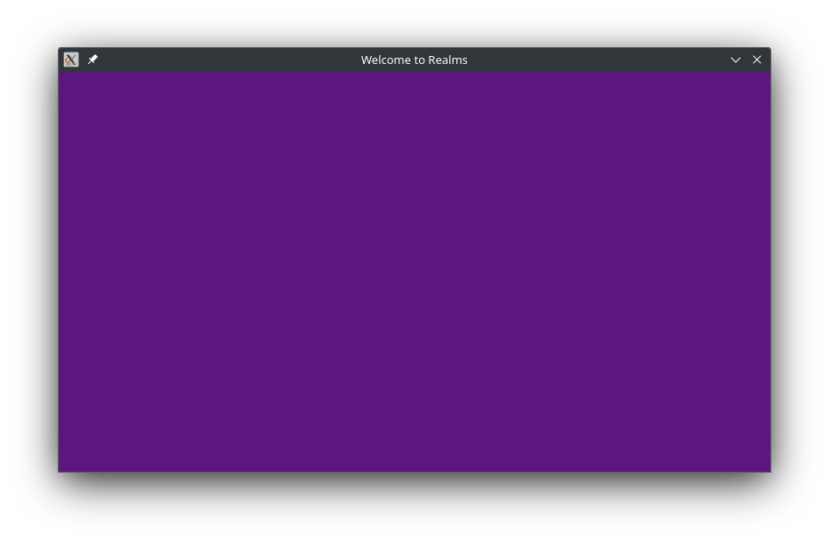

# Welcome to Realms - the lightweight Rust game library

Realms is a library that allows you to easily make games, animations and any 2D graphics using Rust.

This is a 'mid-level' crate which provides an extremely simple API to easily
draw to a graphical window, without being bloated like a typical game *engine*.
Realms is a **game library**.

## Book

The best way to get started is to read the Realms book:
[https://github.com/dylanopen/realms/tree/main/docs/book.md]

Alternatively, below is a basic guide to getting started with Realms.

## Getting started

First, create a new project with `cargo new <project_name>`.
Replace `project_name` with the name of the game you want to create.

Next, import Realms into your Rust project by adding the following line to your
Cargo.toml, under `[dependencies]`:

``` toml
realms = "VERSION_NUMBER"
```

Replace `VERSION_NUMBER` with the latest Realms version.
Alternatively, run this command in your terminal from inside your project
directory:

``` sh
cargo add realms
```

It is also recommended to enable **optimisations** to improve performance.
Add the following at the **end** of your `Cargo.toml`:

``` toml
[profile.dev]
opt-level = 1

[profile.dev.package."*"]
opt-level = 3
```

Finally, add this code to the `src/main.rs` file:

``` rust
use realms::*; // import everything from realms

fn main()
{
    let mut w: Window = Window::new("Welcome to Realms", 800, 450); // create window frame
    let fill: Rect = Rect::fill(&w, Color::rgb(91, 23, 127)); // create a rectangle that fills the screen

    while w.is_running() { // loop while window is open
        w.new_frame(); // initialise a new window frame (and draw to screen)
        fill.draw(&mut w); // draw fill node to clear the screen purple
    }
}
```

Running this code using `cargo run` will give you this result:



Congratulations! You have successfully written your first Realms game :\)

> Note: For more info, please see the full explanation in the book at
[github.com/dylanopen/realms](https://github.com/dylanopen/realms/tree/main/docs/book.md)

## Documentation

The above example is just a very brief introduction to the Realms library.

**The best way to learn the Realms library is to**
[**read the book**](https://github.com/dylanopen/realms/tree/master/docs/book.md).

For documentation on specific fields, structs and functions, see the
documentation on [docs.rs](https://docs.rs/realms).

Thanks for choosing Realms to build your next great game!

